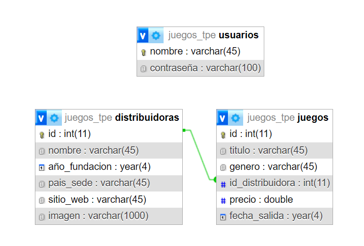

Hecho por Facundo Arana (A) y Julián Yañez (B) | Grupo 62.

Página de Ventas de Claves de Juegos de Steam

Este proyecto tiene como objetivo desarrollar una página web destinada a la venta de claves para juegos
de Steam. La plataforma permitirá a los usuarios adquirir claves para una amplia variedad de
juegos.

**-Características Principales:**

•Página Principal: La página principal mostrará los juegos del catálogo y las distribuidoras.

•Página de Juegos: Esta página permitirá a los usuarios ver los juegos disponibles en el catálogo.

•Página de Distribuidoras: Esta página permitirá a los usuarios ver las distribuidoras que poseen juegos
publicados en el catálogo.

•Página de Administración: Esta página permitirá a los administradores realizar tareas administrativas
como la adición, eliminación y edición de distribuidoras y juegos.

--------------------------------------------------------------------------------------------------------------------

**-Planteo de la base de datos:**

En el proyecto diseñamos dos tablas principales: una de juegos y otra de distribuidoras, las cuales están relacionadas de manera que una distribuidora puede tener varios juegos, pero cada juego pertenece únicamente a una distribuidora. Esta es una relación 1 a N, lo que significa que mientras una distribuidora puede publicar varios juegos, cada juego está asociado solo a una distribuidora.

Por ejemplo, una empresa como Ubisoft puede ser la distribuidora de múltiples títulos como Assassin's Creed o Far Cry, pero esos juegos no pueden estar simultáneamente ligados a otra distribuidora.

El sistema, además, utiliza una tabla llamada usuarios para gestionar el acceso de los administradores. En esta tabla se guarda la información de los usuarios que tienen permisos para acceder y modificar el contenido del sitio web, como agregar o eliminar juegos y distribuidoras.

Las contraseñas de los usuarios no se almacenan en texto plano, sino que se guardan de forma segura utilizando un hash. Esto significa que, en lugar de guardar la contraseña directamente, se guarda un valor encriptado que solo puede compararse, pero no revelarse directamente.

--------------------------------------------------------------------------------------------------------------------

**-¿Cómo desplegar la base de datos?:**

El proyecto incluye una función de autodeploy que crea automáticamente la base de datos necesaria y sus tablas si no existen.

Alternativamente, si se desea importar la base de datos manualmente, puede hacerse usando el archivo db/juegos_tpe.sql que se encuentra en la carpeta db del proyecto.

El usuario administrador tiene nombre "webadmin" y contraseña "admin".

--------------------------------------------------------------------------------------------------------------------

**-Diagrama de la base de datos:**
